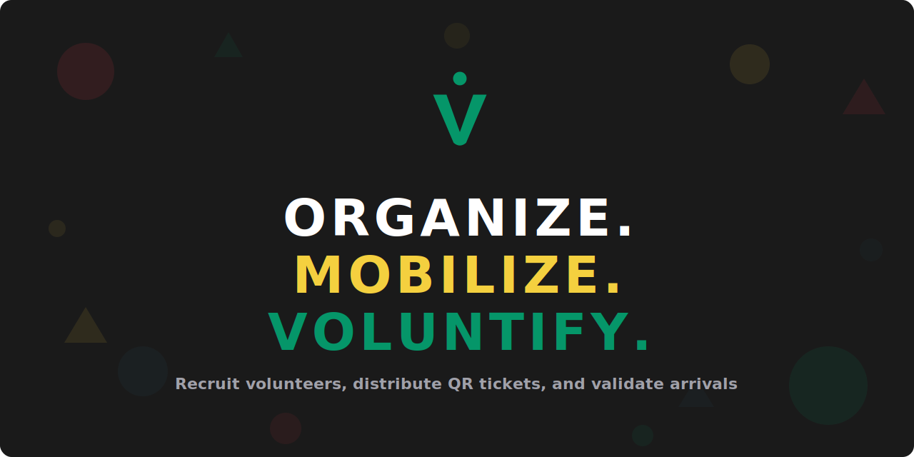

# Voluntify

Volunteer management for event-running organizations. Volunteers sign up without creating an account, receive QR-coded event tickets via magic links, and get validated at the entrance — even offline.

## Why Voluntify?

Small and mid-sized nonprofits, festivals, and community organizations struggle with volunteer coordination. Existing tools like VolunteerHub are expensive and force volunteers through cumbersome account creation. Voluntify combines the entire volunteer lifecycle — recruiting, ticketing, and entrance validation — in one affordable tool with zero friction for volunteers.

## Features

- **Passwordless volunteer signup** — Public event pages where volunteers browse jobs/shifts and sign up with just their name and email
- **QR ticket generation** — JWT-based tickets delivered via magic links, no account required
- **Offline QR scanning** — PWA scanner with Service Worker and IndexedDB that works without internet
- **Manual lookup** — Search and validate volunteers when QR scanning isn't possible
- **Role-based access** — Organizer, Volunteer Admin, and Entrance Staff roles per organization
- **Event management** — Full CRUD for events, volunteer jobs, and shifts
- **Customizable emails** — Organization-branded ticket and notification templates

## Tech Stack

- **Backend**: PHP 8.5, Laravel 12, Laravel Fortify (auth)
- **Frontend**: Livewire 4, Flux UI, Tailwind CSS 4, Alpine.js
- **QR**: `chillerlan/php-qrcode` (server-side SVG), `jsQR` (client-side scanning)
- **JWT**: `firebase/php-jwt` with per-event, per-period HMAC key rotation
- **Offline**: Service Worker, IndexedDB, Web Crypto API
- **Testing**: Pest 4 (PHP), Vitest (TypeScript)
- **Infrastructure**: Laravel Sail (Docker), MariaDB, Mailpit

## Prerequisites

- [Docker Desktop](https://www.docker.com/products/docker-desktop/) (or Docker Engine + Compose)
- A [Flux UI](https://fluxui.dev) license (free tier works)

## Getting Started

```bash
# Clone the repository
git clone https://github.com/your-org/voluntify.git
cd voluntify

# Copy environment file
cp .env.example .env

# Configure Flux UI credentials
composer config http-basic.composer.fluxui.dev "${FLUX_USERNAME}" "${FLUX_LICENSE_KEY}"

# Install dependencies
docker run --rm \
    -u "$(id -u):$(id -g)" \
    -v "$(pwd):/var/www/html" \
    -w /var/www/html \
    laravelsail/php85-composer:latest \
    composer install --ignore-platform-reqs

# Start the environment
vendor/bin/sail up -d

# Generate application key
vendor/bin/sail artisan key:generate

# Run migrations and seed
vendor/bin/sail artisan migrate --seed

# Install frontend dependencies and build
vendor/bin/sail npm install
vendor/bin/sail npm run build
```

The application is now available at [http://localhost](http://localhost).

## Development

```bash
# Start all dev services (server, queue worker, log tail, Vite)
vendor/bin/sail composer run dev

# Or start services individually
vendor/bin/sail up -d              # Docker containers
vendor/bin/sail npm run dev        # Vite dev server with HMR
```

### Useful Commands

```bash
vendor/bin/sail artisan migrate          # Run migrations
vendor/bin/sail artisan db:seed          # Seed database
vendor/bin/sail artisan test --compact   # Run test suite
vendor/bin/sail bin pint                 # Fix code style
```

### Mail

Mailpit catches all outgoing email in development. Access the dashboard at [http://localhost:8025](http://localhost:8025).

## Testing

```bash
# Run all tests
vendor/bin/sail artisan test --compact

# Run a specific test file
vendor/bin/sail artisan test --compact tests/Feature/ExampleTest.php

# Filter by test name
vendor/bin/sail artisan test --compact --filter=testName

# Run JavaScript tests (scanner modules)
vendor/bin/sail npx vitest run
```

## Project Structure

```
app/
├── Actions/          # Single-responsibility action classes
├── Livewire/         # Livewire components (pages & UI)
├── Models/           # Eloquent models
├── Policies/         # Authorization policies
├── Services/         # Domain services (JWT, QR, etc.)
└── Http/Controllers/ # API controllers (scanner sync)

resources/
├── views/            # Blade templates & Livewire views
├── js/scanner/       # TypeScript modules for PWA scanner
└── css/              # Tailwind CSS

planning/
├── design/           # Domain research & app design spec
└── specs/            # Implementation specs & status tracking

tests/
├── Feature/          # Pest feature tests
├── Unit/             # Pest unit tests
└── js/               # Vitest tests for scanner modules
```

## CI

GitHub Actions runs on every push and PR to `main`:

- **Linter** — Laravel Pint code style checks
- **Tests** — Full Pest suite against PHP 8.4 and 8.5
- **Docker** — Builds and pushes to GHCR on push to `main`

## License

MIT
