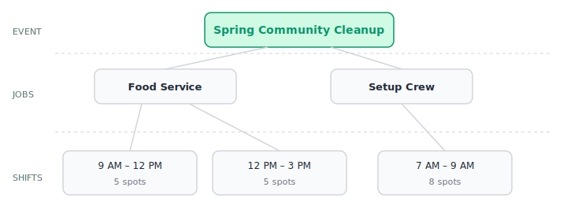

# Getting Started

This guide walks you through setting up your first event in Voluntify.

## Prerequisites

- **Invite only**: Voluntify is invite-only. You need an invitation from an existing Organizer or a system administrator to get started.
- **Modern browser**: Chrome, Firefox, Safari, or Edge (latest versions).

## Your First 15 Minutes

### 1. Accept Your Invitation

You'll receive an email with a temporary password. Log in at your organization's Voluntify URL, then set a new password when prompted. A real-time requirements checklist shows which password rules you've satisfied as you type.

### 2. Create an Event

1. Click **Events** in the sidebar.
2. Click **Create Event**.
3. Fill in the event name, start date, end date, and location.
4. Click **Create**. Your event is created in **Draft** status.

### 3. Add Jobs and Shifts

1. From the event page, click the **Jobs & Shifts** tab.
2. Click **Add Job** and enter a name (e.g., "Registration Desk"), description, and any instructions volunteers should know.
3. Within the job, click **Add Shift** and set the start time, end time, and capacity (how many volunteers you need).
4. Repeat for each job and shift your event needs.

### 4. Publish and Share

1. Go back to the **Overview** tab.
2. Click **Publish**. This makes your event's public signup page live.
3. Copy the **public event URL** and share it with potential volunteers.

That's it -- volunteers can now sign up for shifts, and they'll receive a QR-coded ticket by email.

## Key Concepts

### Event Lifecycle

Events move through three statuses:

- **Draft** -- Being set up. Not visible to volunteers.
- **Published** -- Live and accepting signups. Volunteers can see the public page and register.
- **Archived** -- Event is over. Read-only, no new signups.

### Jobs vs Shifts

- A **Job** is a role volunteers fill (e.g., "Food Service", "Setup Crew").
- A **Shift** is a specific time slot within a job (e.g., "9:00 AM - 12:00 PM, 5 spots").
- Volunteers sign up for a specific shift within a job.

### Passwordless Volunteers

Volunteers don't need accounts. They sign up with just their name and email. They receive a magic link by email that gives them access to their QR ticket -- no password required.

### Two Types of Check-In

- **Event arrival** (entrance scanning): Confirms a volunteer has physically arrived at the event. Done by Entrance Staff using the QR scanner.
- **Shift attendance** (attendance tracking): Records whether a volunteer showed up to their specific shift on time. Done by Volunteer Admins.

## Navigation Overview

The sidebar contains the main navigation:

| Sidebar Item | What It Does |
|---|---|
| **Organization switcher** | Switch between organizations or create a new one (top of sidebar) |
| **Dashboard** | Overview of upcoming events and key metrics |
| **Events** | List, create, and manage events |
| **Scanner** | QR ticket scanner for event entrances (Organizer and Entrance Staff only) |
| **Activity Log** | View organization activity log (Organizer only) |

Within an event, tabs let you navigate between sections:

| Tab | What It Shows |
|---|---|
| **Overview** | Event details, metrics, publish/archive actions, share link |
| **Jobs & Shifts** | Manage volunteer jobs and their time-based shifts |
| **Emails** | Customize automated email templates |
| **Announcements** | Send messages to all event volunteers (Organizer only) |
| **Volunteers** | List of signed-up volunteers with search and filters |
| **Attendance** | Mark shift-level attendance |

Settings are accessible from the user menu in the sidebar. See [Settings and Account](settings-and-account.md) for details.
