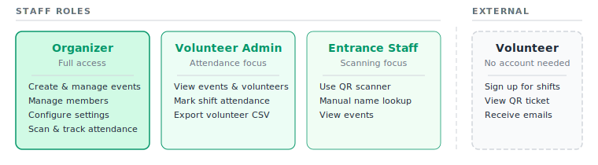

# Roles and Permissions

Voluntify has three staff roles and one external role. Staff roles are assigned per organization.

## Permission Matrix

| Action | Organizer | Volunteer Admin | Entrance Staff |
|---|:---:|:---:|:---:|
| **Events** | | | |
| View events list | Yes | Yes | Yes |
| View event details | Yes | Yes | Yes |
| Create events | Yes | -- | -- |
| Edit events | Yes | -- | -- |
| Publish events | Yes | -- | -- |
| Archive events | Yes | -- | -- |
| Clone events | Yes | -- | -- |
| **Jobs & Shifts** | | | |
| View jobs and shifts | Yes | Yes (read-only) | -- |
| Create / edit / delete jobs | Yes | -- | -- |
| Create / edit / delete shifts | Yes | -- | -- |
| **Email Templates** | | | |
| View and edit email templates | Yes | -- | -- |
| **Volunteers** | | | |
| View volunteer list | Yes | Yes | -- |
| View volunteer details | Yes | Yes | -- |
| Export volunteer CSV | Yes | Yes | -- |
| **Attendance** | | | |
| View attendance | Yes | Yes | -- |
| Mark attendance (On Time / Late / No Show) | Yes | Yes | -- |
| **Gear** | | | |
| Set up gear items (add / remove) | Yes | -- | -- |
| Track gear pickup | Yes | Yes | -- |
| **Custom Fields** | | | |
| Set up custom registration fields | Yes | -- | -- |
| **Scanner** | | | |
| Use QR scanner | Yes | -- | Yes |
| Use manual lookup | Yes | -- | Yes |
| **Member Management** | | | |
| View members | Yes | -- | -- |
| Invite / remove members | Yes | -- | -- |
| Change member roles | Yes | -- | -- |
| Leave organization | Yes | Yes | Yes |
| **Settings** | | | |
| Edit own profile and password | Yes | Yes | Yes |
| Set up two-factor authentication | Yes | Yes | Yes |
| Configure email / SMTP settings | Yes | -- | -- |
| View activity log | Yes | -- | -- |
| **Organizations** | | | |
| Switch organizations | Yes | Yes | Yes |
| Create new organization | Yes | Yes | Yes |
| **Announcements** | | | |
| Send announcements | Yes | -- | -- |
| View announcement history | Yes | -- | -- |
| **Dashboard** | | | |
| View dashboard | Yes | Yes | Yes |
| "Create Event" quick action | Yes | -- | -- |

## Volunteer Role (External)

Volunteers are external participants -- they don't have user accounts and don't log into the admin interface.

Volunteers can:
- View public event pages and sign up for shifts (no login needed).
- Receive email notifications (signup confirmation, pre-shift reminders).
- Access their QR ticket via a magic link (no password required).
- Present their QR code at the event entrance.
- Access the [Volunteer Portal](recruiting-volunteers.md#volunteer-portal) to view their shifts and read announcements.
- Cancel their own shift signups if the organizer has enabled cancellations and the cutoff window hasn't passed.
- Fill in custom registration fields during signup.
- View their gear assignments and pickup status in the portal.

Volunteers **cannot**:
- Access the admin interface (Dashboard, Events, Scanner, Settings).
- View other volunteers' information.
