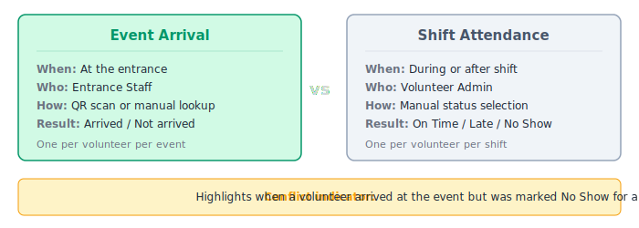

# Tracking Attendance

Attendance tracking records whether volunteers showed up to their assigned shifts and whether they were on time. This is separate from entrance scanning -- arrival confirms they're at the event, attendance confirms they reported to their shift.

**Who can mark attendance**: Organizer and Volunteer Admin.

## Mark Attendance for a Shift

1. Go to **Attendance** in the event sidebar.
2. Select a shift from the shift selector. Shifts are grouped by job.
3. You'll see a roster of all volunteers signed up for that shift.
4. For each volunteer, click one of the status buttons:
   - **On Time** -- The volunteer arrived at their shift on time.
   - **Late** -- The volunteer arrived but after the shift started.
   - **No Show** -- The volunteer didn't show up to their shift.

You can change a volunteer's status at any time by clicking a different button. This is useful if you marked someone as "No Show" but they arrive late.

## Understanding the Attendance View

The attendance view shows two distinct pieces of information for each volunteer:

| Column | Meaning |
|---|---|
| **Arrival** | Whether the volunteer has been scanned in at the event entrance (from QR scanner or manual lookup). This is informational only. |
| **Attendance** | The shift-level status you set: On Time, Late, or No Show. |

A **conflict indicator** highlights cases where a volunteer arrived at the event (has an arrival record) but was marked No Show for their shift. This may mean they arrived at the event but didn't report to their station.

### Status Summary

At the top of the roster, a summary shows the count of:
- On Time
- Late
- No Show
- Unmarked (no status set yet)

This helps you quickly see how many volunteers still need to be accounted for.

## Attendance via QR Scanner

In addition to the Attendance tab, Organizers and Volunteer Admins can mark attendance directly from the QR scanner and Manual Lookup pages. Each scan result shows the volunteer's shifts with a **Mark** button for recording attendance on the spot.

This is useful during busy events when you want to handle arrival and attendance in a single step. See [Recording Shift Attendance from the Scanner](checking-in-volunteers.md#recording-shift-attendance-from-the-scanner) for details.

## Attendance Grace Period

The attendance grace period is an optional per-event setting that defines how many minutes after a shift starts a scan is still considered **On Time**. Scans after the grace window are marked **Late**.

For example, if a shift starts at 10:00 AM and the grace period is 15 minutes, a volunteer scanned at 10:12 AM is marked On Time. A volunteer scanned at 10:16 AM is marked Late.

If no grace period is set, any scan after the shift start time is marked Late.

Configure this in **Edit Event Details** under **Attendance Grace Period (minutes)**. See [Edit Event Details](creating-events.md#edit-event-details).

## Automatic No-Show Detection

Voluntify automatically marks volunteers as **No Show** if their shift ended more than 2 hours ago and no attendance was recorded. This runs hourly in the background, so you don't need to manually go through every shift to flag no-shows.

You can still override an automatic No Show by changing the volunteer's status on the Attendance tab or from the scanner -- for example, if they did show up but weren't scanned.
